# VSCode + Git 全流程可视化操作指南（超详细保姆级）

> 本教程让小白从零开始，用 VSCode 完成 Git 的全部操作：安装、版本管理、分支合并、远程推送、SSH 配置、冲突解决、标签管理、LFS 上传大文件等。全程图形化操作，让复杂的 Git 命令行变得一目了然。

## 一、前言

VSCode 不只是编辑器，更是一个 **Git 可视化控制台**。通过插件支持，我们可以在图形化界面中完成几乎所有 Git 操作：

- 初始化、提交、回退
- 分支创建与合并
- 远程推送、拉取
- 冲突解决与差异对比

让 Git 的复杂命令行操作变得一目了然。

## 二、Git 安装与环境检测

### 1）下载地址

Git 官方下载页：[https://git-scm.com/downloads](https://git-scm.com/downloads)

> 💡 **注意**：根据你的系统选择对应版本（Windows / Linux / macOS）。安装时建议自定义目录，C 盘空间充足则可默认安装。

### 2）安装步骤

详细安装教程可参考 Git 官方文档。如果之后想上传大文件到 GitHub，记得勾选 **Git LFS**：

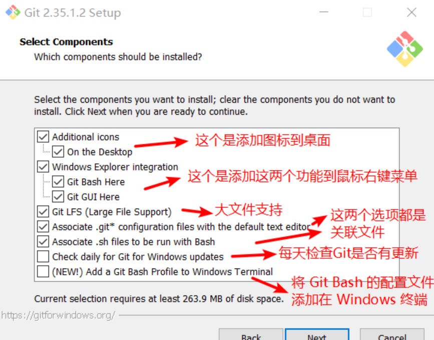

其他的一路 `Next` 即可，安装结束后在文件夹右键鼠标，看到以下菜单图标，说明安装成功：

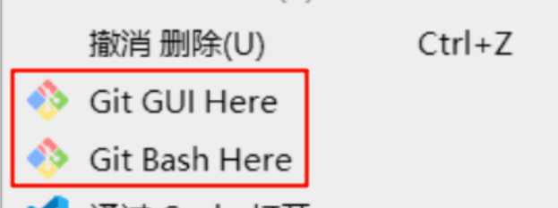

### 3）检查是否安装成功

成功安装 Git 后，VSCode 页面显示这样就是安装成功了：

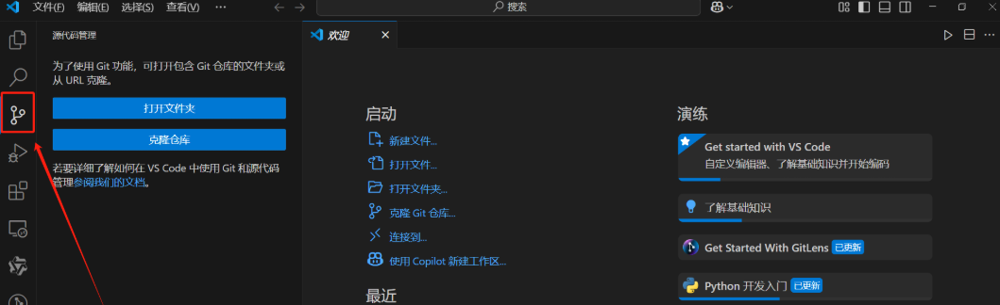

在 VSCode 底部终端输入：

```bash
git --version
```

若输出版本号即表示安装成功。

## 三、VSCode Git 插件配置

建议安装以下三个核心插件：

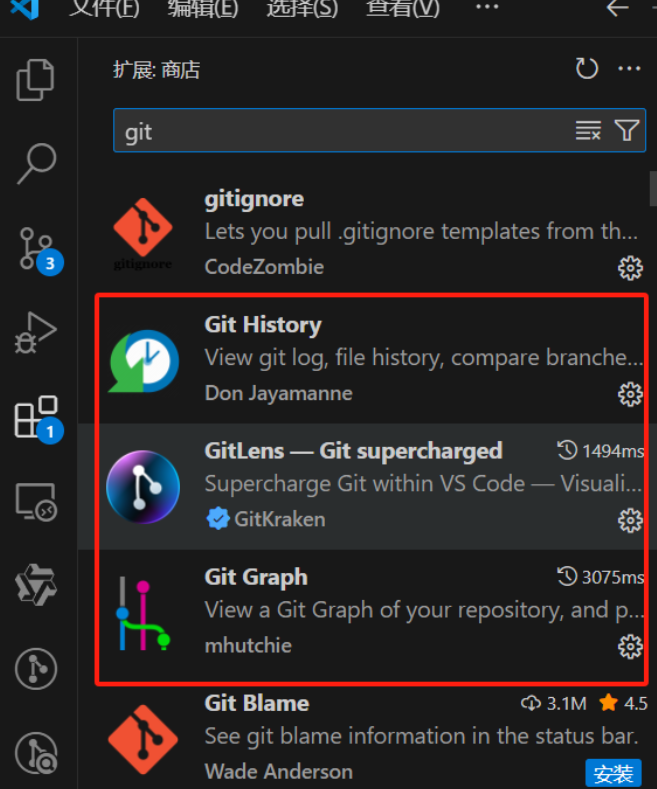

| 插件名称 | 功能 |
|----------|------|
| **GitLens** | 查看历史提交、比较文件、冲突解决 |
| **Git Graph** | 分支可视化管理与合并操作 |
| **Git History Diff** | 查看详细历史记录与差异 |

安装完成后，左侧侧边栏会出现「源代码管理」图标。

## 四、Git 本地代码版本控制

### 4.1 设置全局 Git 用户名和邮箱

第一次使用 Git，请先配置全局的用户名和邮箱（将以下命令的用户名邮箱替换成你自己的）：

```bash
git config --global user.name "Your Name"
git config --global user.email "youremail@yourdomain.com"
```

配置完成后，通过以下命令确认这些信息：

```bash
git config --list
```

### 4.2 初始化仓库

打开项目文件夹 → 点击左侧「源代码管理」→ 选择「初始化仓库」。

此时会生成一个隐藏文件夹 `.git/`：

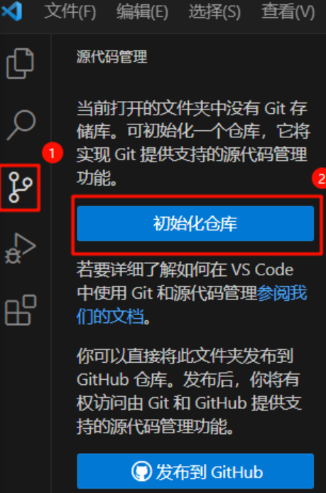

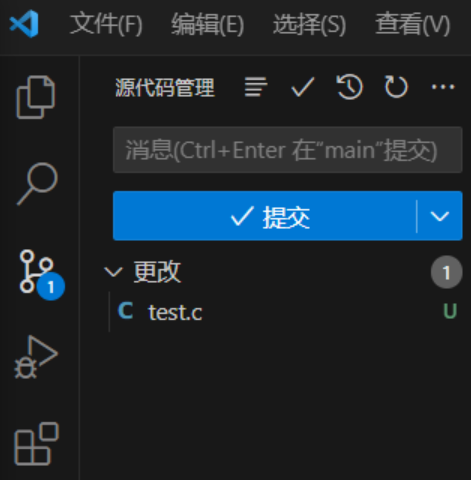

### 4.3 暂存与提交

修改文件后，左侧会显示「更改」文件。

点击 `＋` 号暂存更改（相当于 `git add`）：

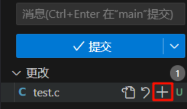

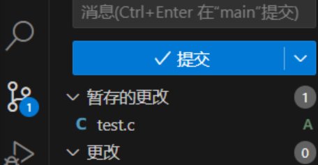

在消息栏输入提交说明（用来描述代码变化的目的和内容，方便浏览版本差异）：

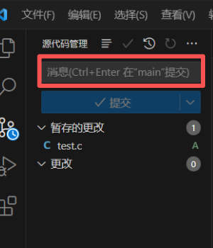

点击 ✔ 提交（相当于 `git commit -m "msg"`）：

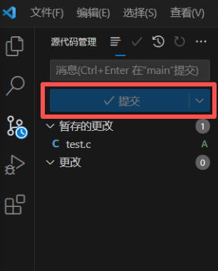

若未在消息栏填写内容就点击了提交按键，会弹出一个 `COMMIT_EDITMSG` 文件，在文件第一行填写注释内容，保存并关闭，也可完成提交：

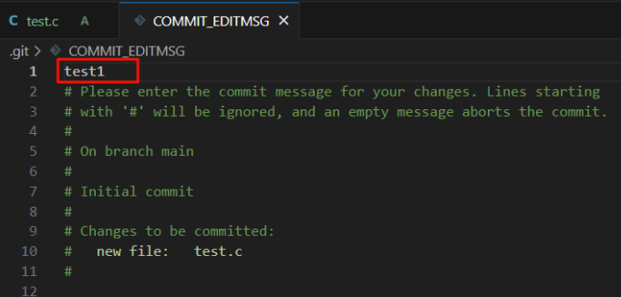

> 💡 **小提示**：提交信息不能为空，否则 VSCode 会自动弹出 COMMIT_EDITMSG 文件要求填写。

### 4.4 VSCode 左侧文件栏右侧字母含义

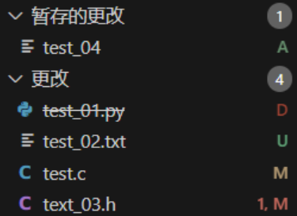

| 字母 | 含义 |
|------|------|
| **A** | Added 的缩写，文件是新增的，已添加到暂存区等待提交 |
| **U** | Untracked 的缩写，文件未跟踪，需手动添加或忽略 |
| **M** | Modified 的缩写，文件被修改 |
| **D** | Deleted 的缩写，文件被删除 |
| **1,M** | 文件有一个错误，后面的字母代表文件状态 |

### 4.5 文件修改与版本历史

**1）修改文件时，VSCode 左侧会显示：**

- 🟢 绿色：新增内容
- 🔵 蓝色：修改内容
- 🔴 红色：删除内容

**2）版本记录**

点击「View History」即可查看版本记录（依赖 Git History 插件）：

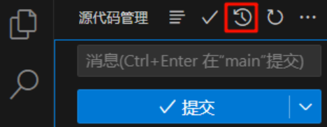

在 Git History 界面可以看见所有历史版本信息，左侧有版本名称（即你添加的注释，可以相同）和上传时间，右侧有版本的 hash 码（不同），是版本的唯一标识符：

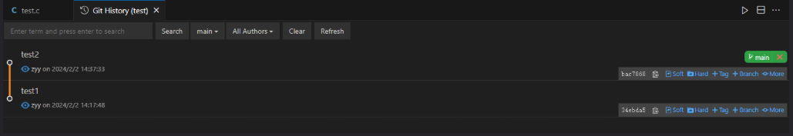

点击版本，可以看到该版本相比上一版本进行了哪些操作。例如 test7 版本相比 test6 版本，添加了 test_02.txt、删除了 text_03.h、修改了 test.c：

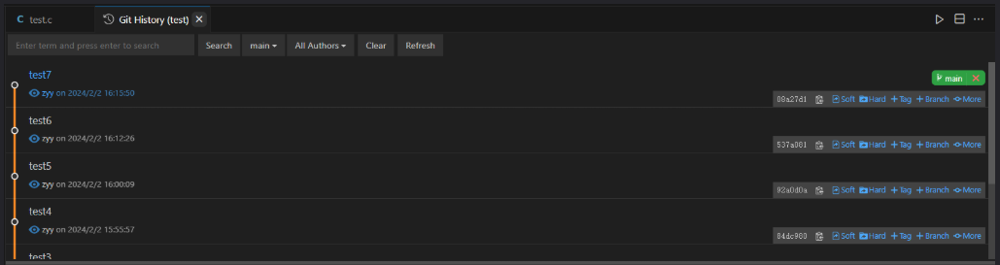

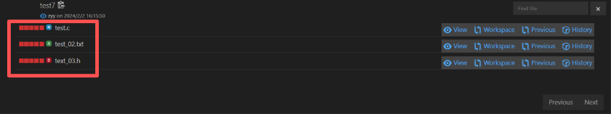

点击 `view`，可以看到该版本的该文件的内容：

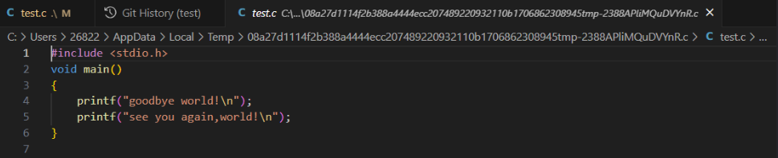

点击 `Workspace`，可以看到该版本与**当前工作空间内容**的对比：

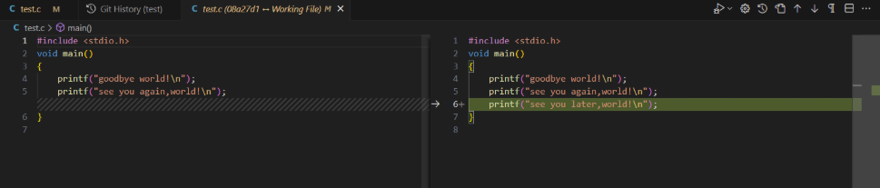

点击 `Previous`，可以看到该版本与**上一版本文件内容**的对比：

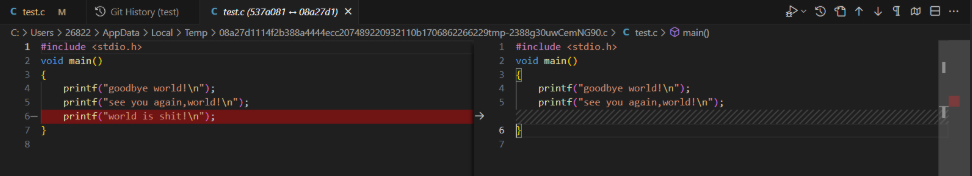

点击 `History`，可以看到该文件**所有被修改的历史版本**：

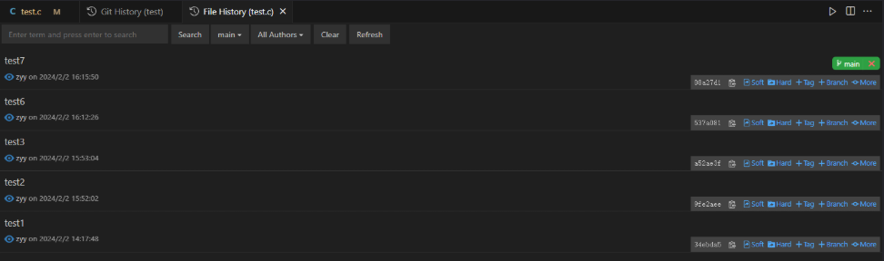

### 4.7 版本对比与回退

点击资源管理器时间线图标查看版本差异：

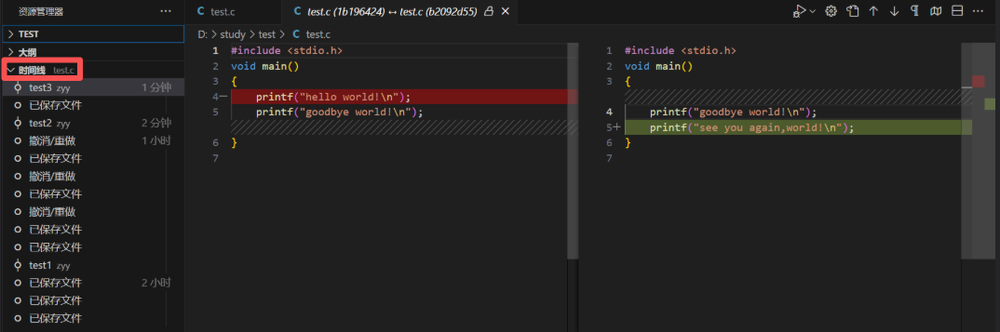

可进行「软回退（Soft）」或「硬回退（Hard）」：

| 模式 | HEAD 移动 | 暂存区 | 工作区 |
|------|-----------|--------|--------|
| **Soft** | 移动到旧版本 | 保留 | 保留 |
| **Hard** | 回退到旧版本 | 清空 | 清空 |

### 4.8 分支管理

**创建分支**

点击「源代码管理」右上角的 `...` → 「分支」→ 「创建分支」；或在底部状态栏直接点击当前分支名（如 main），输入新分支名即可。

**切换分支**

点击左下角分支名 → 选择要切换的分支。

> ⚠️ **注意**：未提交的修改需先提交或撤销。

**合并分支**

通过 Git Graph 可视化右键 → 「合并到当前分支」；或者切换到主分支，点击「源代码管理」右上角三个点，选择「分支 → 合并」。

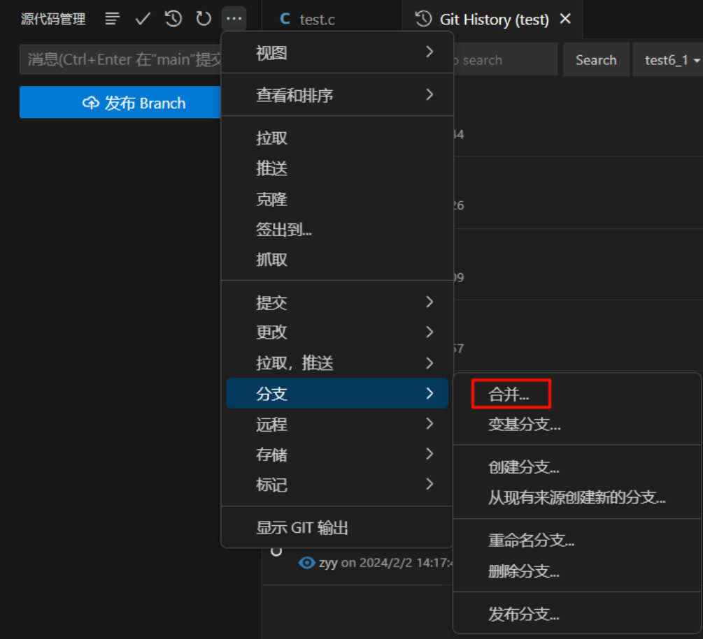

**删除分支**

```bash
git branch -d branchname
```

### 4.9 标签创建与推送

在 Git Graph 中右键任意提交 → 「创建标签」，输入版本号或标识（如 v1.0.0），再执行推送即可同步远程。

## 五、远程仓库管理

### 5.1 创建远程仓库

登录 GitHub 或 Gitee → 点击「New repository」→ 填写名称 → Create。

复制生成的 HTTPS 或 SSH 地址备用。

### 5.2 创建 SSH 密钥

在 VSCode 终端输入：

```bash
ssh-keygen -t rsa -C "你的邮箱"
```

一路回车后，会在 `~/.ssh/` 下生成：

- `id_rsa`（私钥）
- `id_rsa.pub`（公钥）

复制 `id_rsa.pub` 内容 → 进入 GitHub → Settings → SSH and GPG keys → New SSH key。

### 5.3 推送与拉取

**添加远程仓库**

```bash
git remote add origin git@github.com:yourname/repo.git
```

**推送本地到远程**

```bash
git push -u origin main
```

或在 VSCode 中：源代码管理 → 同步更改（即 push + pull）。

**拉取远程更新**

`...` → 拉取（Pull）。

### 5.4 克隆远程仓库

复制仓库地址 → VSCode 命令面板输入：

```bash
Git: Clone
```

粘贴链接即可。

## 六、冲突解决与代码 Review

**冲突解决**

冲突产生时，VSCode 会自动打开合并编辑器，可选择：

- 接受当前更改
- 接受传入更改
- 保留双方更改

也可通过 GitLens 对比不同提交版本，完成后重新提交即可。

**代码 Review**

使用 GitLens 直接查看某次提交的修改详情，对比前后代码差异，一目了然。

## 七、多账户管理（多 SSH 配置）

如果你有多个 GitHub 账号：

**1️⃣ 生成多个密钥**

```bash
ssh-keygen -t rsa -C "one@gmail.com" -f "id_rsa_one"
ssh-keygen -t rsa -C "two@gmail.com" -f "id_rsa_two"
```

**2️⃣ 配置 `~/.ssh/config`**

```bash
# 账号1
Host github_one
    HostName github.com
    IdentityFile ~/.ssh/id_rsa_one
    User git

# 账号2
Host github_two
    HostName github.com
    IdentityFile ~/.ssh/id_rsa_two
    User git
```

**3️⃣ 推送时使用**

```bash
git remote add origin git@github_two:username/repo.git
```

## 八、Git 高级技巧

### 8.1 忽略文件 .gitignore

创建 `.gitignore` 文件：

```bash
# 忽略日志文件
*.log

# 忽略 node_modules
node_modules/

# 忽略临时文件
*.tmp

# 保留 README
!README.md
```

被忽略的文件会显示为灰色。

### 8.2 Git LFS 上传大文件

GitHub 限制单文件 ≤ 100MB，大文件请使用 LFS：

```bash
git lfs install
git lfs track "data/*.zip"
git add .gitattributes
git add .
git commit -m "use lfs"
git push
```

### 8.3 网络与权限问题

若 push 报错：

```bash
fatal: unable to access 'https://github.com/...': SSL_ERROR_SYSCALL
```

解决方案（配置代理）：

```bash
git config --global http.proxy http://127.0.0.1:7890
git config --global https.proxy http://127.0.0.1:7890
```

如无代理，取消：

```bash
git config --global --unset http.proxy
git config --global --unset https.proxy
```

## 九、常用 Git 命令汇总

| 操作 | 命令行 | VSCode 操作 |
|------|--------|-------------|
| 初始化仓库 | `git init` | 源代码管理 → 初始化仓库 |
| 添加暂存 | `git add .` | 「+」暂存更改 |
| 提交 | `git commit -m "msg"` | 「✔」提交 |
| 推送 | `git push` | 同步更改 |
| 拉取 | `git pull` | 同步更改 |
| 创建分支 | `git branch dev` | 右下角分支 → 新建分支 |
| 切换分支 | `git checkout dev` | 状态栏点击切换 |
| 合并分支 | `git merge` | Git Graph 可视化操作 |
| 回退 | `git reset --soft/hard` | Git History → Soft / Hard |
| 查看日志 | `git log` | GitLens / Git Graph |
| 删除分支 | `git branch -d dev` | Git Graph 删除 |

## 十、总结

VSCode 集成的 Git 功能，让版本控制从"记一堆命令"变成"点点鼠标"。对于新手来说，先用可视化界面理解 Git 的运作流程，再逐步接触命令行，是最平滑的学习路径。

核心要点回顾：

1. **装好工具**：Git + VSCode 三大插件（GitLens、Git Graph、Git History Diff）
2. **会用四步**：初始化 → 暂存 → 提交 → 推送
3. **善用历史**：版本对比、回退、分支管理都能可视化完成
4. **多账户管理**：通过 SSH config 优雅切换
5. **大文件用 LFS**：突破 GitHub 100MB 限制

掌握这些，日常开发中的版本管理就足够应对了。

---

*如果你觉得这篇文章对你有帮助，欢迎点赞、收藏、转发！*
